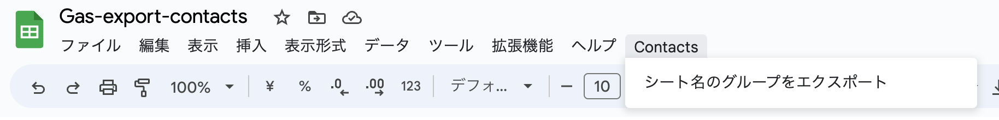

# Gas Export Contact

Google アカウントの連絡先を宛名職人仕様の項目名でスプレッドシートに出力する。

## インストール

事前に[google/clasp](https://github.com/google/clasp#create)を使える状態が必要。

- [Google Apps Script API](https://script.google.com/home/usersettings)の有効化
- [`clasp login`](https://github.com/google/clasp#login)でのログイン

上記ができている状態で次のコマンドを実行する。

```
git clone https://github.com/HeRoMo/gas-export-contacts.git
cd gas-export-contacts
npm install
npm run clasp:install
npm run clasp:push
npm run clasp:open 
```

## 使い方

1. Script のコンテナドキュメントを開く
2. エクスポートしたい Google コンタクト（連絡先）のラベル名の名前のシートを選択する
   なければ作る。
3. [Contacts]-[シート名のグループをエクポート]をクリックする
  
4. 連絡先情報がスプレッドシート書き出される。

## 出力データ

[宛名職人 - 2023年](https://www.sourcenext.com/product/atenasyokunin/) に合わせた出力をする。

|出力カラム名|連絡先|
|---|---|
|姓|names[0].familyName|
|名|names[0].givenName|
|姓かな|names[0].phoneticFamilyName|
|名かな|names[0].phoneticGivenName|
|自宅〒|address.type=='home'のaddresses.postalCode|
|自宅住所1|address.type=='home'のaddresses.region|
|自宅住所2|address.type=='home'のaddresses.streetAddress|
|連名|relations.type=='spouse'のrelations.person|

## ライセンス

[MIT](LICENSE)
